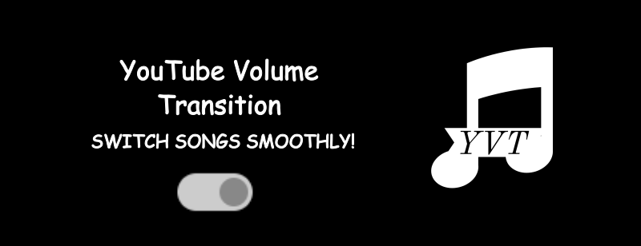

# 🎵 YouTube Volume Transition 🎧

Hey there, groovy human! 🕺 Ever been vibing to some smooth tunes on YouTube, and then - *BOOM* - your pal sneakily switches to a new track, and the volume blasts your eardrums? Say goodbye to those not-so-mellow vibes! Immerse yourself in the gentle embrace of **YouTube Volume Transition**. 



## How Does It Work? 🎩✨
Imagine you're jamming to some lo-fi beats and then your over-eager buddy jumps in to play the latest viral sensation. Instead of assaulting your eardrums, this nifty extension takes the edge off, gently easing the volume down. It's like having a well-mannered volume butler at your beck and call.

## Features 🌟
- **Smooth Transitions**: Wave goodbye to unexpected audio ambushes.
- **Toggle On/Off**: Sometimes, life calls for abrupt volume changes. We get it. 
- **Elegantly Simple**: No clutter, no fluff.

## Setting It Up 🛠
1. Clone this repo: 
   ```
   git clone https://github.com/Ananyapam7/YouTubeVolumeTransition
   ```
2. Fire up Chrome (or any Chromium based browser like Brave) and head over to `chrome://extensions/`
3. Click that **Developer mode** toggle.
4. Click **Load unpacked** and select the cloned directory.
5. Play a tune, switch it up, and revel in the auditory elegance on YouTube!

## Wanna Jam With Us? 🤝
Stumbled upon a glitch? Dreamt up a wicked feature? Dive in! We're all ears for pull requests. If you're thinking big, do us a solid: open an issue first, share your thoughts, and let's make sweet music together.

## License 📜
Distributed under the [MIT](https://choosealicense.com/licenses/mit/) license.

## Let's Connect
Don't hesitate to connect with me on [LinkedIn](https://www.linkedin.com/in/ananyapam-de-523757166/) if you wanna share something cool about this project or otherwise!